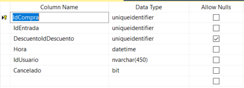
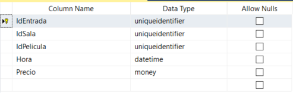
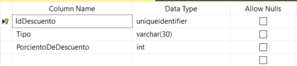

# Cine Web API


## Estructura del Proyecto 


### Detalles 

 
Primero comenzamos diseñando la base de datos e hicimos un modelo 
entidad relacional extendido. Una vez tuvimos el diseño de la base 
de datos entonces tratamos de crearla en un gestor de bases de datos.
En nuestro caso usamos SQLServer y nos apoyamos en el entorno visual 
**Microsoft SQL Server Management** para poder crear las tablas de la 
base de datos. Un vez creada la base de datos entonces creamos una 
plantilla de Web API con **Visual Studio 2019** y usamos EntityFramework
Core para traernos la base de datos que teníamos en SQL para un modelo 
en C# con clases y poder usar EntityFramework Core para manejar la base
de datos. 

Después comenzamos con el diseño de los controladores y el flujo de 
datos de la aplicación. Entonces trabajamos en los controladores de la 
aplicación. Primero trabajamos en el controlador *PeliculasController.cs*
que se encarga de gestionar las películas del cine. Después trabajamos 
en el controlador *SalaController.cs* que maneja las salas que hay en el
cine , así como los asientos que existen en las salas. 


- #### Controladores
    ```
    Controllers
        |- AccountController.cs
        |- ComprasController.cs
        |- EntradasController.cs
        |- PeliculasController.cs
        |- SalasController.cs
        |- SociosController.cs
    ```

- #### Data
  
    En esta carpeta están las clases y modelos que se usan tanto 
    para insertar , actualizar y borrar registros de la base de 
    datos. Entonces tenemos un conjunto de interfaces que son los 
    modelos que usamos para el manejo de la base de datos con 
    Entity Framework.  
    
    *interfaces*
    ```
        Data 
            |- IComprasRepository.cs
            |- IEntradasRepository.cs
            |- IPeliculasRepository.cs
            |- ISalasRepository.cs
            |- ISocioRepository.cs
    ```

    *Las clases que implementan las interfaces*
    ```
            |- ComprasRepository.cs
            |- EntradasRepository.cs
            |- PeliculasRepository.cs
            |- SalasRepository.cs
            |- SocioRepository.cs
    ```
  
- #### DBModels
  
    ```
        DBModels    
            |- Asientos.cs
            |- CineContext.cs
            |- CineUser.cs
            |- Compras.cs
            |- Descuento.cs
            |- Entradas.cs
            |- Peliculas.cs
            |- Sala.cs
            |- Socio.cs
    ```

- #### Migrations
    En esta carpeta están las migraciones que Entity Framework
    registra para los cambios que se hacen en la base de datos.  

- #### Models
    En esta carpeta están los modelos que se usan para diversas 
    funciones en la aplicación 

```
    Models 
        |- PeliculaModels.cs
        |- SalaModels.cs
        |- UserInfo.cs
        |- EntradaQueryModels.cs 
```
  
### Requerimientos 

Básicamente la aplicación esta hecha en C#  y usa una base de datos 
que se maneja con el gestor de Bases de Datos SQLServer.

Los paquetes que usa la aplicación son los siguientes: 


  
Es importante instalar estos paquetes en la solucion para que 
la solución corra en correctamente. 


## Estructura de la base de datos 

### Tablas de la Base de Datos

En esta imagen se muestran todas las tablas que maneja nuestra solución en la 
base de datos *Cine*

 


### Detalles de las Tablas de la Base de Datos

 - ##### Tabla Película 
    Esta tabla se utiliza para almacenar las películas con los datos 
    correspondientes que hay en el cine y que el administrador del cine 
    puede poner en las salas del cine   

    

 - ##### Tabla Sala 

    Esta tabla es para representar las Salas que hay en el cine donde
    pueden ser vistas las películas que se ponen en el cine

    

 - ##### Tabla Compra 
   
    Esta tabla es para representar las Compras de entradas que se realizan en 
    la base de datos 

    

 - ##### Tabla Entrada
    Esta tabla es para representar las posibles entrada que hay para el cine 
    
   

 - ##### Tabla Descuento 
   
    Esto es para representar los descuentos que se le pueden aplicar a una 
    compra por un usuario determinado

   

 - ##### Tabla CompraAsientos
   
    Esto es para representar la compra de un asiento o de varios asientos 
    para una entrada determinada por un usuario dado.

   

### Diagrama del modelos de la Base de Datos

    